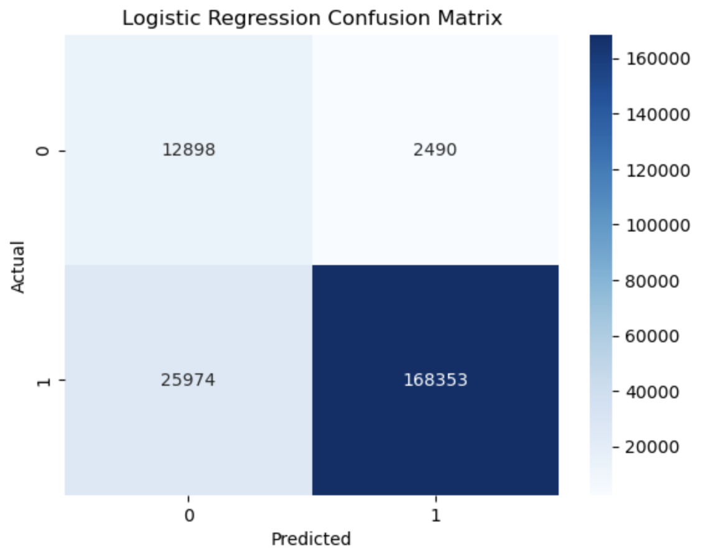
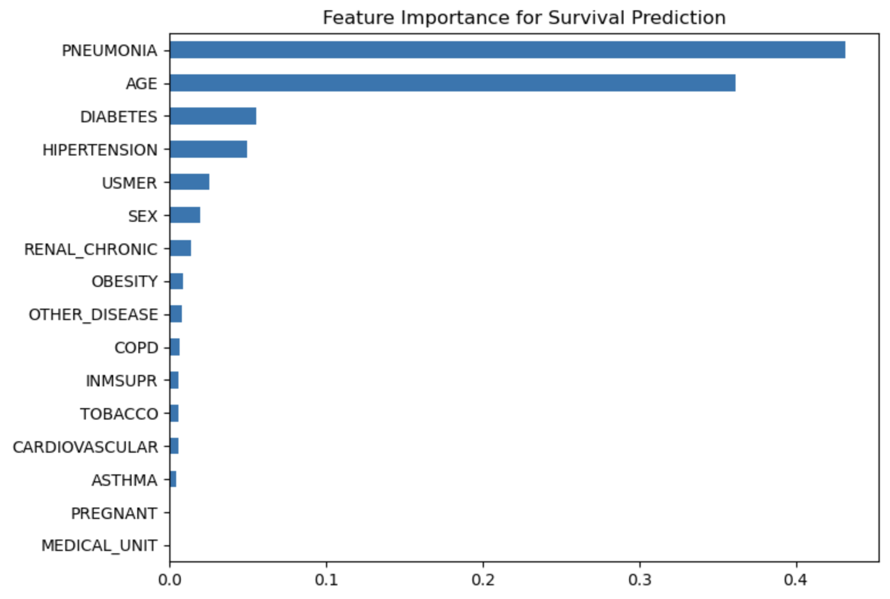

# Patient Survival Risk Prediction Using Machine Learning
A machine learning project that predicts patient survival using clinical data, achieving ~92% accuracy and identifying key risk factors such as age and comorbidities.

## Overview

This project develops a machine learning model to predict patient survival outcomes based on clinical and demographic data. The goal is to identify key risk factors and evaluate how well different models can classify survival outcomes.

---

## Objectives

* Predict patient survival using classification models
* Compare multiple machine learning algorithms
* Identify the most important features influencing survival

---

## Dataset

* Source: https://www.kaggle.com/datasets/meirnizri/covid19-dataset
* Target Variable: Survival outcome (e.g., survived vs not survived)
* Features include:

  * Age
  * Gender
  * Medical conditions
  * Other clinical indicators

---

## Methodology

### 1. Data Preprocessing

* Handled missing values
* Encoded categorical variables
* Scaled numerical features

### 2. Exploratory Data Analysis (EDA)

* Distribution of survival outcomes
* Feature relationships and correlations

### 3. Model Development

The following models were trained and evaluated:

* Logistic Regression
* Random Forest

### 4. Model Evaluation

* Accuracy
* Precision / Recall
* F1 Score
* ROC-AUC

---

## Results

* Best performing model: Logistic Regression
* Accuracy: 92%
* ROC-AUC: 0.8786
* Key predictive features:

  * Pneumonia
  * Age

---

## Visualizations

This project includes:

* Confusion matrix
* Feature importance plots




---

## Additional Materials

- Full Report: [View Report](reports/project_write_up.pdf)
- Presentation Slides: [View Slides](reports/CovidSurvival_presentation.pdf)

---

## How to Run

```bash
git clone https://github.com/ChrisACr/Covid_survival_prediction.git
cd Covid_survival_prediction
pip install -r requirements.txt
python main.py
```

---

## Key Insights

* Certain demographic and clinical features significantly impact survival probability
* Tree-based models performed better at capturing nonlinear relationships

---

## Tools & Technologies

* Python
* Pandas, NumPy
* Scikit-learn
* Matplotlib / Seaborn

---

## Project Structure

```
Covid_survival_prediction/
│
├── data/
├── notebooks/
├── src/
├── images/
├── README.md
└── requirements.txt
```

---

## Future Improvements

* Hyperparameter tuning
* Additional feature engineering
* Testing more advanced models (e.g., XGBoost)
